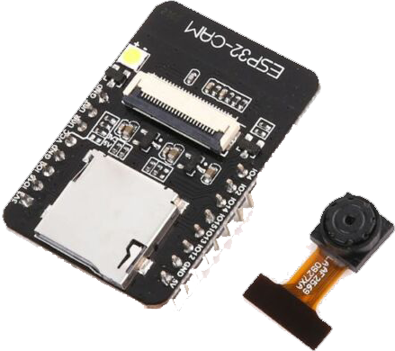
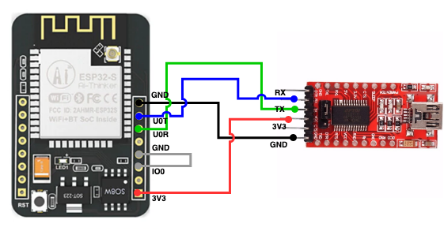

Provides a wireless camera feed for use in Home Assistant and/or any other application.

## **Project: Wireless Camera Feed**

### **Hardware:**

* Single ESP32-CAM AI-Thinker micro controller board.
* FTDI USB UART adapter to flash your board.
* Antenna accessory (Optional)
* 5V Power Adapter for powering the device after flashing.  You can also use a standard wall charger or USB port to power the unit.

FT232RL

### **Software**

Rather than using a local utility on your desktop or laptop, we're going to connect the FTDI USB adapter to the same systeem that's running Home Assistant and then use the [ESPHome](https://esphome.io/) Add-On to configure and flash the board.

### **Preparing to Flash**

Make sure you've wired up your connector as follows, paying **close attention to the loop back pins**.  This is required in order to flash.

### **ESPHome Dashboard**

Fire up your ESPHome Dashboard in Home Assistant from the add-on, or the sidebar if you've configured the add-on to display in the sidebar.  If you can't get ESPHome to load due to a `502 Bad Gateway` error, use the port address in the configuration for the add-on and access it using a normal URL, e.g.: http://yourHomeAssistant.com:6052, or http://192.168.X.X:6052.

!!! Note
    I've published [information regarding the 502 Bad Gateway problem](https://homeassistant.jongriffith.com/How-To-Tutorials/Trouble-Shooting/502-Bad-Gateway-Errors-In-HASS.io/) that solved it for my setup.

* Start adding a new node.
* Give it a name that will make sense.
* Select the `Generid ESP32 (Wrover Module)`
* Enter your WIFI information.  _**It is case sensitive**_.
* Add a custom access password if you prefer.  It's optional.
* Submit your settings.
* Select your upload port.  It should read something like `/dev/ttyUSB0 (FT232R USB UART)`  This will be device and system dependent, so it won't be exact.  You can confirm the correct port by unplugging the FTDI connector to see which port disappears from the dropdown.

_**If you're ready to flash, go for it**_.  **BUT** ... you still need to configure your board for the camera and any attached devices in accordance with the ESPHome configuration instructions on the [ESPHome website](https://esphome.io).