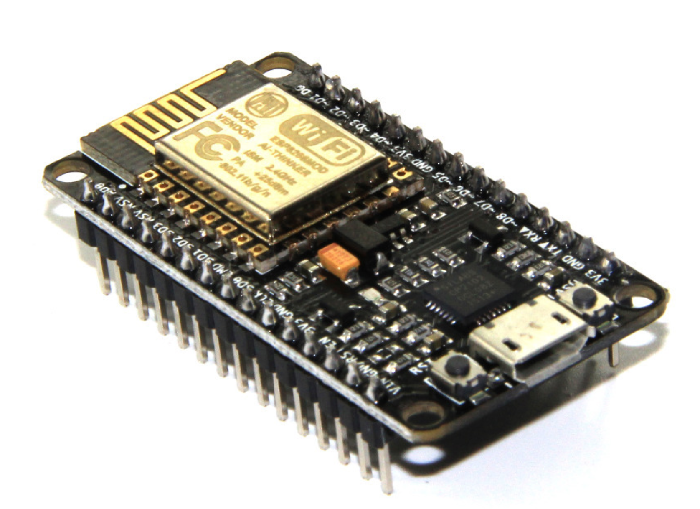

## **Project: Magnetic Door with RFID Reader**

I'm using a single NodeMCU1.0 to setup a magentic door lock using RFID.  The original project can be found here:

* [https://github.com/esprfid/esp-rfid](https://github.com/esprfid/esp-rfid)

Mark Philipp Hammermann made some nice changes to the original by adding a few features.  You can read about them in his repo.

* [https://github.com/marelab](https://github.com/marelab)

He also created a very elaborate NodeRED flow to manage his RFID network of locks.

* [https://github.com/marelab/rfid-door-node-red](https://github.com/marelab/rfid-door-node-red)

tests