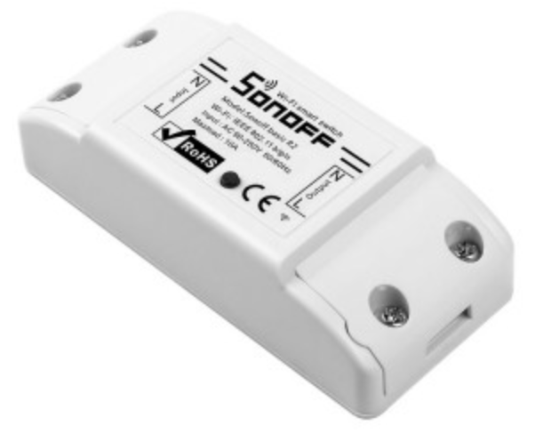

Small wireless relay switches.

These are great little solutions for anything plugged into the wall that you'd like to add to your home automation system.  It's a simple relay that acts as a WIFI switch for whatever it's plugged into.