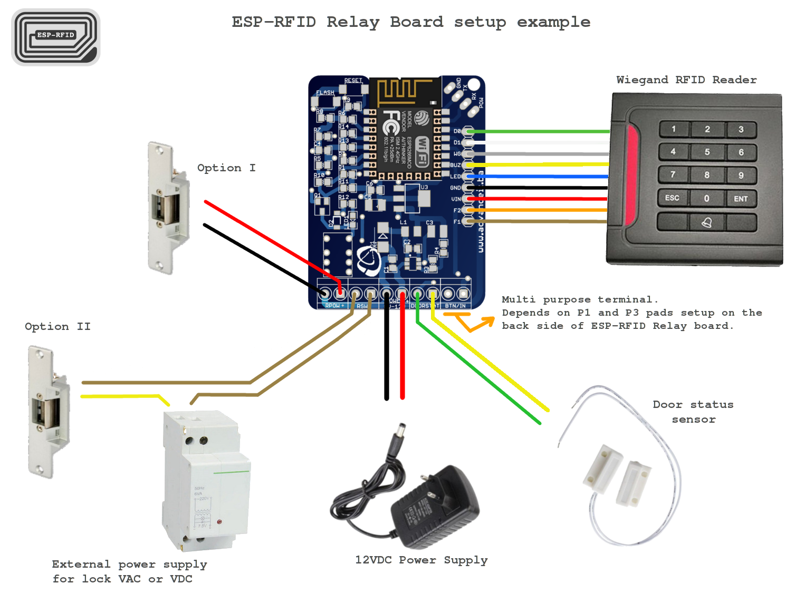

# ESP-RFID Door Access System

Original Repo:  [ESP-RFID](https://github.com/esprfid)

!!! note
    On January 28th, 2019, ESP-RFID version 1.0.2 was released.  A few months later, version 1.3.1 Test Release was dropped after [@marelab](https://github.com/marelab) added a few desired features to the project.

    This project is based upon the most recent release which is, as of June 22nd, 2019, version 1.3.3 Hot Fix Release.

    It also incorporates the NodeRED flow found on @marelab's GitHub repo which you can [read about here](https://github.com/marelab/rfid-door-node-red).

The [esp-rfid](https://github.com/esprfid/esp-rfid) repo contains most of what you need to make this project happen.

This process presumes you have purchased the actual hardware provided by the original creator on the Tindie store.

## Tools Needed

* Small flathead screwdriver (very small), like the size of a jeweler's flat-head screwdriver.  The terminals on the board are tiny.
* Size 2 hex nut driver.  Mine is in the form of a bit from a DeWalt driver bit set.  There are 4 small bolts holding the acrylic case together.
* Something to strip wires.

## Hardware Needed

1. The ESP-RFID Relay Board, which incidentally, came with version 1.0.3 of the ESP-RFID firmware already flashed to the ESP8266 chip.
* A 12V Power Supply with at minimum 2 Amps of power output, if you plan on powering the board -and- a magnetic door lock from a single power source.
* A Weigand RFID Reader.  From what I've read, the project has been designed to work with nearly all Weigand RFID readers.  I used [this one](https://www.amazon.com/gp/product/B01LWRQMN5/ref=ppx_yo_dt_b_asin_title_o00_s00?ie=UTF8&psc=1).
* Compatible RFID cards or keyfobs.  The weigand readers read a specific type of card.

## Steps

1. The relay board that I received had the ESP-RFID firmware already installed, but it was an older version.  Download the latest release (1.3.1) of the ESPRFID firmware.
* Extract the downloaded Zip file.  You'll be uploading the file called `generic.bin` when the time comes.
* Disassemble the acrylic case that the board is mounted in to give clear access to all of the wiring terminals.
* Connect the positive and negative wires from your 12V power supply to the power terminals on the board.
* Power up the device.  You'll see a blue light, and the device will broadcast a WIFI network called ESP-RFID or something of that nature.
* Connect to that WIFI network and then point your browser to http://esp-rfid.local or http://192.168.4.1.
* Using this interface, upload the firmware mentioned in step 2 and update the device.
* Find your way back to the web interface and begin to make changes to the settings according to your particular setup.  WIFI, MQTT, admin password, etc.
* Re-establish a connection to the device through your web browser while connected to your regular WIFI network.  Now you know that it's part of your network.
* I would strongly advise setting a static IP, based upon the device's MAC address, in your router to ensure it's always using the same address every time.  This is not covered here.
* From the `Hardware Settings` link under the `Settings` menu from the esp-rfid web interface, click the blue `test` button.  You should see a light on the board light up for a moment, and hear a click.  The `Activate Time` setting on the `Hardware Settings` page determines how long the relay will be active.
* Now that you have a relay that responds to the software, go ahead and disconnect the power and wire up your Weigand reader to the board following the wiring guide below.
* Fire up the board again and you should immediately see a light on the reader and hear a beep.

## Wiring Guide

